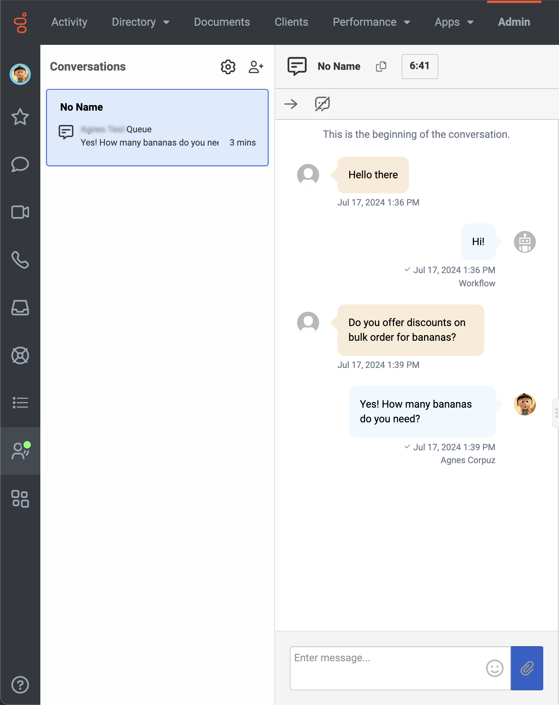

:::{"alert":"primary","title":"About Genesys Cloud Blueprints","autoCollapse":false} 
Genesys Cloud blueprints were built to help you jump-start building an application or integrating with a third-party partner. 
Blueprints are meant to outline how to build and deploy your solutions, not a production-ready turn-key solution.
 
For more details on Genesys Cloud blueprint support and practices 
please see our Genesys Cloud blueprint [FAQ](https://developer.genesys.cloud/blueprints/faq) sheet.
:::

This Genesys Cloud Developer Blueprint explains how to build an iOS mobile app that uses the Mobile SDK for web messaging. Deploy all the components used in this solution with the Terraform Genesys Cloud CX as Code provider.


* [Scenario](#scenario)
* [Solution components](#solution-components)
* [Prerequisites](#prerequisites)
* [Implementation steps](#implementation-steps)
* [Additional resources](#additional-resources)

## Scenario

An organization wants to allow their customers to start a web message with an agent from the organization's mobile application:

1. **The customer initiates a web message interaction.** The agent receives the customer's incoming interaction and answers the message.

2. **The agent and customer interact.**

3. **The agent or customer ends interaction.**

## Solution components

* **Genesys Cloud CX** - A suite of Genesys Cloud services for enterprise-grade communications, collaboration, and contact center management. In this solution, you use an Architect inbound message flow, a Genesys Cloud integration, a Genesys Cloud queue, web messaging configuration, and web messaging deployment.
* **Genesys Cloud Mobile Messenger SDK** - Genesys Cloud Mobile Messaging enables a visitor to enter your app, converse with an agent, and return later to continue the conversation. The Genesys Cloud system retains conversation history, which is retrieved for users at the beginning of a conversation. This functionality enables users to seamlessly navigate through past messages within the ongoing conversation.
* **CX as Code** - A Genesys Cloud Terraform provider that provides an interface for declaring core Genesys Cloud objects.

## Prerequisites

### Specialized knowledge

* Administrator-level knowledge of Genesys Cloud
* Familiarity with Terraform

### Genesys Cloud account

* A Genesys Cloud license. For more information, see [Genesys Cloud Pricing](https://www.genesys.com/pricing "Opens the Genesys Cloud pricing page") on the Genesys website.
* The Master Admin role. For more information, see [Roles and permissions overview](https://help.mypurecloud.com/?p=24360 "Opens the Roles and permissions overview article") on the Genesys Cloud Resource Center.
* CX as Code. For more information, see [CX as Code](https://developer.genesys.cloud/devapps/cx-as-code/ "Goes to the CX as Code page") on the Genesys Cloud Developer Center.

### Development tools that run in your local environment

* Terraform (the latest binary). For more information, see [Download Terraform](https://www.terraform.io/downloads.html "Goes to the Download Terraform page") on the Terraform website.

## Implementation steps

### Download the repository that contains the project files

1. Clone the [mobilesdk-sample-ios repository](https://github.com/GenesysCloudBlueprints/mobilesdk-sample-ios "Opens the mobilesdk-sample-ios repository in GitHub").

### Set up Genesys Cloud

1. Open a Terminal window and set the following environment variables:

 * `GENESYSCLOUD_OAUTHCLIENT_ID` - The Genesys Cloud client credential grant ID that CX as Code executes against. 
 * `GENESYSCLOUD_OAUTHCLIENT_SECRET` - The Genesys Cloud client credential secret that CX as Code executes against. 
 * `GENESYSCLOUD_REGION` - The Genesys Cloud region in your organization.

2. Run Terraform in the folder in which you set the environment variables. 

### Configure your Terraform build

In the **blueprint/terraform/dev.auto.tfvars** file, set the following values that are specific to your Genesys Cloud organization:

* `email`    - The email account that you use with Genesys Cloud. It will be used to assign you to the appropriate Genesys Cloud queue.
* `division` - The division to which the flow is deployed. By default, the new flows are deployed to the **Home** division.

Here is an example of the **dev.auto.tfvars** file.

```
email    = "user@company.com"
division = "Home"
```

### Run Terraform

You are now ready to run this blueprint solution for your organization.

1. Change to the **/terraform** folder.
2. Run the following commands:

* `terraform init` - Initializes a working directory that contains the Terraform configuration files.

* `terraform plan` - Executes a trial run against your Genesys Cloud organization and shows you a list of all the Genesys Cloud resources it creates. Review this list and make sure that you are comfortable with the plan before you continue.

* `terraform apply --auto-approve` - Creates and deploys the necessary objects in your Genesys Cloud account. The `--auto-approve` flag completes the required approval step before the command creates the objects.

After the `terraform apply --auto-approve` command successfully runs, you see the output with the number of objects that Terraform successfully created. Keep the following points in mind:

* This project assumes that you run this blueprint solution with a local Terraform backing state. This means that the tfstate files are created in the same folder where you run the project. Terraform recommends that you use local Terraform backing state files only if you run from a desktop and are comfortable with the deleted files.

* As long as you keep your local Terraform backing state projects, you can tear down this blueprint solution. To tear down the solution, change to the `docs/terraform` folder and run the `terraform destroy --auto-approve` command. This command destroys all objects that the local Terraform backing state currently manages.

### Get messaging deployment details

1. In Genesys Admin UI, go to **Admin** > **Message** > **Messenger Deployments** > **Mobile SDK Web Deployment**, and copy the deployment key.
   

### Test the solution

1. In the mobile app, paste the **Deployment ID** and input the **Domain** based on your Genesys Cloud region (ex. mypurecloud.com).
   
2. As the customer, click the **Start chat** button to start a web message.
   
3. As an agent, answer the incoming web message interaction.
   
4. Repeat sending messages back and forth as agent and customer.
   
5. As the customer, click **End Chat**.

## Additional resources

* [Messenger Mobile SDK](/commdigital/digital/webmessaging/messenger-mobile-sdk/ "Opens the Messenger Mobile SDK page")
* [Github repository for the Build an iOS mobile app that uses the Mobile SDK for web messaging Blueprint](https://github.com/GenesysCloudBlueprints/mobilesdk-sample-ios/ "Opens the Github repository for the Build an iOS mobile app that uses the Mobile SDK for web messaging Blueprint")
